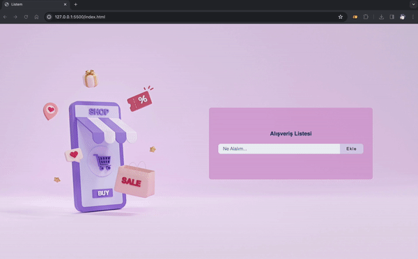

# Alışveriş Listesi Uygulaması 📋

Bu basit alışveriş listesi uygulaması, kullanıcıların kolayca alışveriş listelerini düzenlemelerine olanak tanıyan bir web uygulamasıdır. HTML, CSS ve JavaScript kullanılarak geliştirilmiştir.

## Özellikler
- **Ekleme ve Silme:** Alışveriş listesine öğeler ekleyebilir ve istenirse silebilirsiniz.
- **Temizleme Seçeneği:** Listeyi temizle butonu ile hızlıca sıfırlama imkanı.
- **FontAwesome İkonlar:** Arayüzde FontAwesome kullanılarak ikonlarla zenginleştirilmiştir.

## Nasıl Kullanılır
1. Tarayıcınızda `index.html` dosyasını açın.
2. Form alanına eklemek istediğiniz öğeleri yazın ve "Ekle" butonuna tıklayın.
3. Listeden öğe silmek için ilgili öğenin yanındaki sil butonunu kullanın.
4. "Listeyi Temizle" butonu ile tüm listeyi temizleyin.

## Teknolojiler
- HTML5, CSS3
- JavaScript
- FontAwesome

## Ekran Görüntüsü
 

## Kurulum
Projeyi klonlayın veya ZIP olarak indirin:
```bash
git clone https://github.com/avcisalih/toDoList.git
```

## Katkıda Bulunma
1. Bu depoyu forklayın.
2. Yeni özellik veya düzeltmeler ekleyin.
3. Yaptığınız değişiklikleri açıklayıcı bir şekilde commit edin.
4. Pull request oluşturun.

